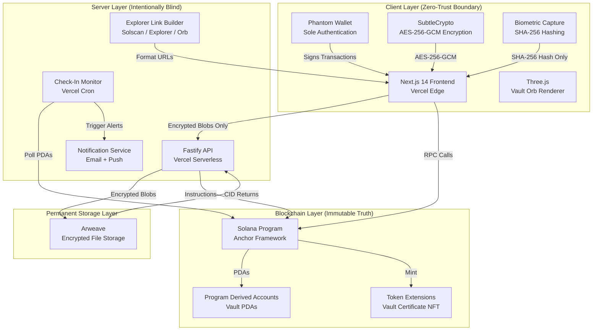
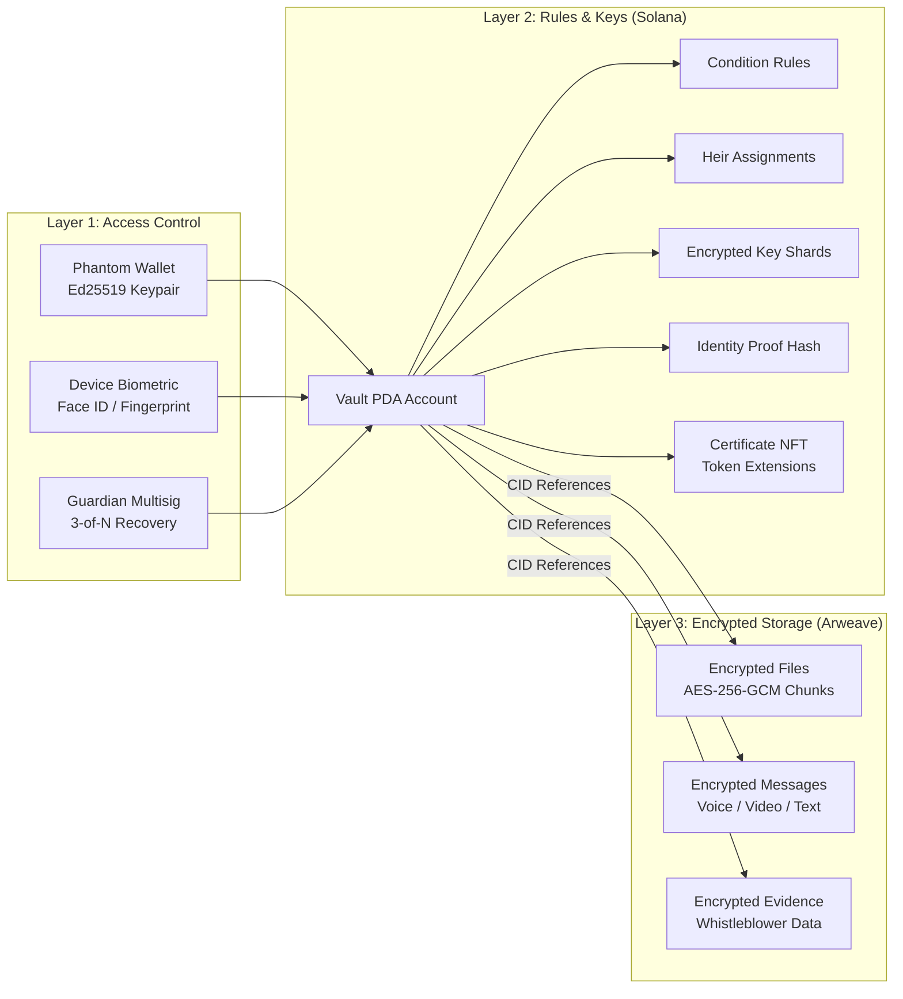
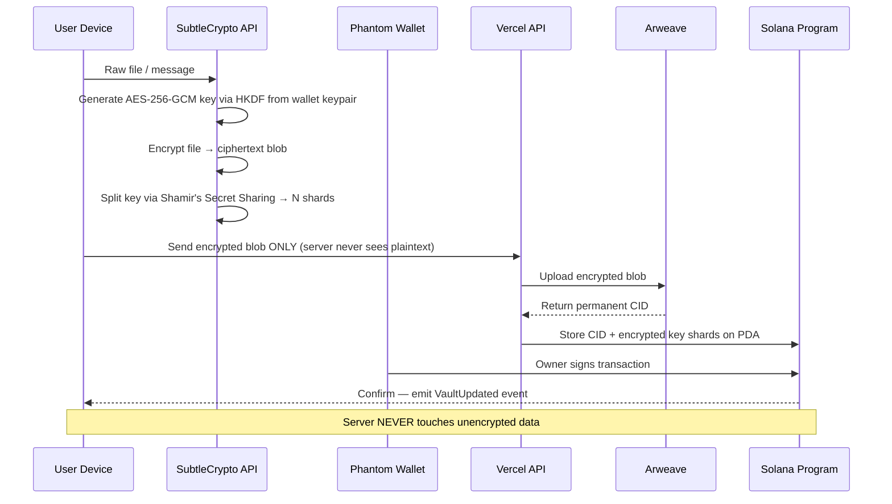
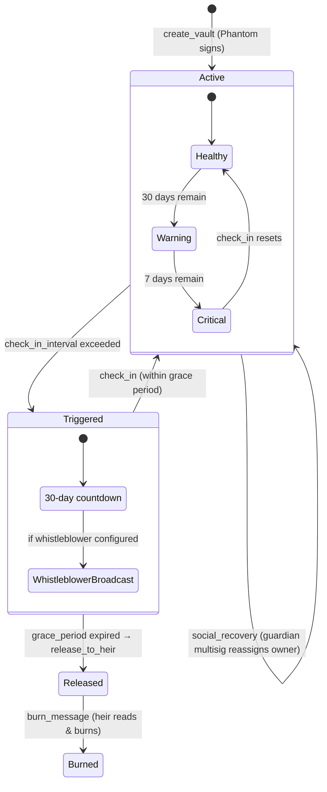
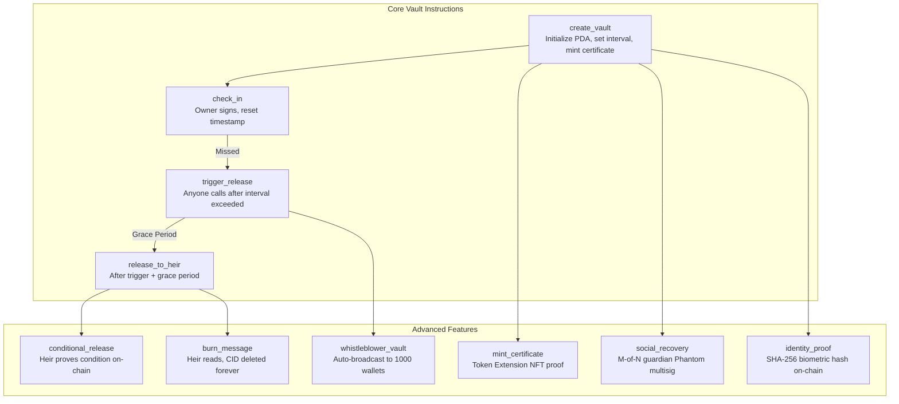

# LegacyX — System Architecture

> **Not even we can touch it.**

## High-Level Architecture

## Three-Layer Vault Architecture

## Encryption Pipeline

## Vault Lifecycle State Machine

## Smart Contract Instruction Map

## Explorer Integration Points

| Action | Solscan | Solana Explorer | Orb (Helius) |
|--------|---------|-----------------|--------------|
| Vault Created | ✅ Transaction link | ✅ Account link | ✅ Visual |
| Check-In Completed | ✅ Transaction link | — | ✅ Visual |
| File Uploaded (CID stored) | ✅ Transaction link | — | — |
| Heir Added | ✅ Transaction link | — | — |
| Vault Triggered | ✅ Transaction link | ✅ Account status | ✅ Visual |
| Vault Released | ✅ Transaction link | ✅ Account status | ✅ Visual |
| Message Burned | ✅ Transaction link | — | — |
| Identity Proved | ✅ Transaction link | ✅ Account link | ✅ Visual |
| Certificate Minted | ✅ Token link | ✅ Token link | — |
| Social Recovery | ✅ Transaction link | ✅ Account link | — |
| Whistleblower Broadcast | ✅ Transaction link | — | ✅ Visual |

## PDA Seed Derivation

| Account | Seeds | Description |
|---------|-------|-------------|
| VaultAccount | `["vault", owner_pubkey]` | Main vault PDA per user |
| VaultCondition | `["condition", vault_pubkey, condition_index]` | Per-condition PDA |
| IdentityProof | `["identity", owner_pubkey]` | Biometric proof PDA |
| GuardianRecord | `["guardian", vault_pubkey, guardian_pubkey]` | Per-guardian approval record |
| WhistleblowerConfig | `["whistleblower", vault_pubkey]` | Broadcast wallet list |
| VaultCertificate | `["certificate", vault_pubkey]` | Token Extension mint account |

## Security Zones

```mermaid
graph TB
    subgraph TrustZone ["TRUSTED — User Device Only"]
        direction TB
        RAW[Raw Files]
        RAWBIO[Raw Biometrics]
        KEYS[Encryption Keys]
        PLAINTEXT[Plaintext Messages]
    end

    subgraph BlindZone ["BLIND — Server (Vercel)"]
        direction TB
        ENCBLOB[Encrypted Blobs]
        METADATA[Request Metadata]
        CIDS[Arweave CIDs]
    end

    subgraph ImmutableZone ["IMMUTABLE — Blockchain"]
        direction TB
        HASHES[SHA-256 Hashes]
        ENCSHARDS[Encrypted Key Shards]
        STOREDCIDS[Stored CIDs]
        RULES[Vault Rules & Conditions]
    end

    TrustZone -->|AES-256-GCM| BlindZone
    TrustZone -->|SHA-256| ImmutableZone
    BlindZone -->|Upload| ImmutableZone

    style TrustZone fill:#1a3a1a,stroke:#4A9B6F
    style BlindZone fill:#3a3a1a,stroke:#D4782A
    style ImmutableZone fill:#1a1a3a,stroke:#C9A96E
```

## Data Flow — What Goes Where

| Data Type | Device | Server | Arweave | Solana |
|-----------|--------|--------|---------|--------|
| Raw files | ✅ Exists temporarily | ❌ Never | ❌ Never | ❌ Never |
| Encrypted files | ✅ Created here | ✅ Passes through | ✅ Stored permanently | ❌ Too large |
| Arweave CIDs | ✅ Displayed | ✅ Routes through | ✅ Generated here | ✅ Stored on PDA |
| Encryption keys | ✅ Derived, used, destroyed | ❌ Never | ❌ Never | ❌ Never |
| Key shards (encrypted) | ✅ Created here | ✅ Passes through | ❌ Not stored | ✅ Stored on PDA |
| Biometric raw data | ✅ Captured & destroyed | ❌ Never | ❌ Never | ❌ Never |
| Biometric SHA-256 hash | ✅ Created here | ✅ Passes through | ❌ Not stored | ✅ Stored on PDA |
| Vault rules | ✅ Set by owner | ✅ Passes through | ❌ Not stored | ✅ Stored on PDA |
| Phantom wallet signature | ✅ Signed here | ✅ Verified here | ❌ Not involved | ✅ Verified on-chain |
